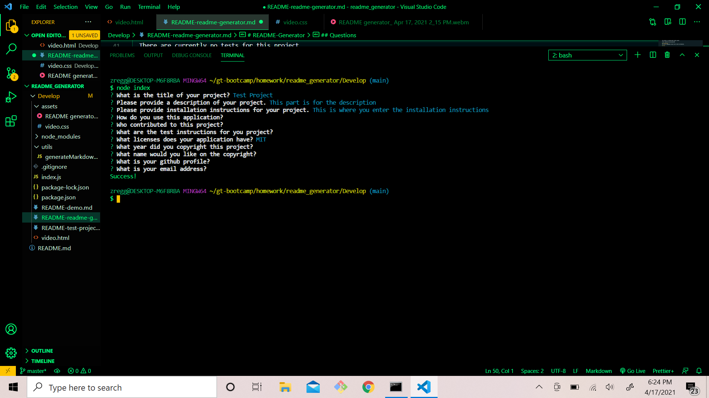
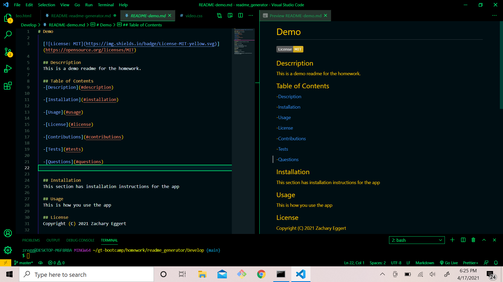

# README-Generator
  
  

  ## Descrription
  This application generates a readme for web applications. It prompts a user with questions for them to answer and adds that input to the markdown file that it generates. This allows for users to create professional readmes that include all the necessary information a good read me should contain.

  ## Table of Contents
  -[Description](#description)

  -[Installation](#installation)

  -[Usage](#usage)

  -[License](#license)

  -[Contributions](#contributions)

  -[Tests](#tests)

  -[Questions](#questions)

  ## Installation
  This application requires inquire.js to be installed to run.

  ## Usage
  From the command line, once inquire is installed and the user is in the appropriate directory, they can run node.js and are prompted with a series of questions that they can answer with the desired information.

  ## License
  Copyright (C) 2021 Zachary Eggert

  This project is licensed under the MIT license.

  https://opensource.org/licenses/MIT

  ## Contributions
  This was an independent project with no other contributions.

  ## Tests
  There are currently no tests for this project.

  ## Questions
  For any questions you can reach me at:
  zreggert@gmail.com

  Also please check out this application's repo and my other work at:
  https://github.com/zreggert

  
  
  

